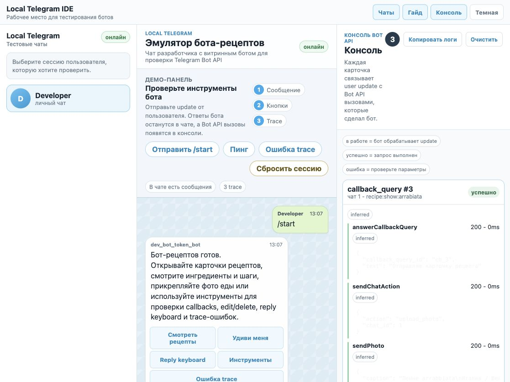
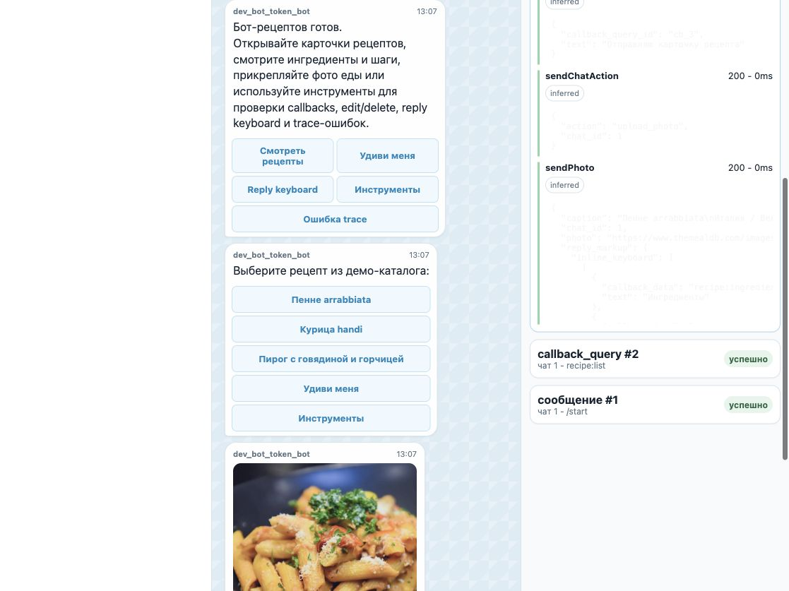
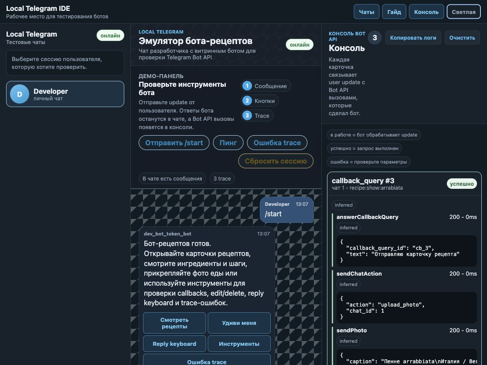

# Local Telegram Client

[](https://github.com/Zulut30/local-telegram-client/actions/workflows/ci.yml)
[](https://github.com/Zulut30/local-telegram-client/actions/workflows/release.yml)

Local Telegram Client is a local Telegram Bot API emulator with a browser IDE for bot developers.
Point any bot SDK at the simulator, open the UI, and test messages, buttons, callbacks, webhooks,
uploads, and traces without a phone, tunnel, or real Telegram connection.

Local Telegram Client - это локальный эмулятор Telegram Bot API с браузерной IDE для разработки
ботов. Подключите любой бот к локальному Bot API, откройте UI и тестируйте сообщения, кнопки,
callbacks, webhooks, загрузки файлов и trace без телефона, туннелей и настоящего Telegram.

**Language:** [English](#english) | [Русский](#русский)



## Screenshots





## English

### What It Does

- Emulates Telegram Bot API endpoints under `/bot<TOKEN>/<method>`.
- Provides a Russian-localized browser IDE with chats, guide panel, trace console, theme toggle,
  attachments, trace copy, and session reset.
- Supports stateful polling, webhooks, injected user messages, callbacks, bot replies, edits,
  deletes, reply markup, typing actions, media-like messages, and trace correlation.
- Stores multipart uploads for `sendPhoto`, `sendDocument`, `sendVideo`, `sendAudio`,
  `sendAnimation`, `sendVoice`, `sendVideoNote`, and `sendSticker` in memory.
- Resolves uploaded files through `getFile` and serves bytes through `GET /_sim/file/{id}`.
- Ships with a recipe showcase bot that demonstrates cards, photos, inline buttons, reply keyboard,
  callback toasts, edit/delete, rich messages, and intentional trace errors.

### Current Status

This project is a developer-preview emulator, not a full production Telegram clone.

| Area | Status |
|---|---|
| Core chat loop | Stateful and covered by integration tests |
| Browser IDE | Usable for demos and local development |
| Bot API registry | Bot API 10.1 method names are recognized case-insensitively |
| Non-core Bot API methods | Many still return compatibility stubs |
| Media storage | In-memory only |
| Persistence, payments, Stars, Mini Apps, inline mode | Roadmap items |
| Hosted SaaS | Future track after self-hosted maturity |

### Quickstart

Build the web UI and binaries:

```sh
make build-frontend
make build
```

Start the simulator:

```sh
./bin/sim
```

Open the IDE:

```text
http://127.0.0.1:8080/
```

Start the recipe showcase bot in another terminal:

```sh
./bin/showcase-bot --mode polling
```

Send `/start` in the browser chat.

### Webhook Demo

Stop the polling showcase bot and run:

```sh
./bin/showcase-bot \
  --mode webhook \
  --webhook-addr 127.0.0.1:8090 \
  --webhook-url http://127.0.0.1:8090/webhook
```

Send `/start` again. The simulator will deliver the update through `setWebhook`, and the trace
console will show the inbound update plus the bot's outgoing Bot API calls.

### Bot API Examples

Point your bot SDK at:

```text
http://127.0.0.1:8080
```

Use the configured fake token, default `dev-bot-token`.

Send a message:

```sh
curl -s -X POST http://127.0.0.1:8080/botdev-bot-token/sendMessage \
  -H 'Content-Type: application/json' \
  -d '{"chat_id":1,"text":"Hello from local Bot API"}'
```

Upload a document and download it back:

```sh
curl -s -X POST http://127.0.0.1:8080/botdev-bot-token/sendDocument \
  -F chat_id=1 \
  -F caption='Local upload' \
  -F document=@README.md
```

Inject a user update from the IDE control plane:

```sh
curl -s -X POST http://127.0.0.1:8080/_sim/inject \
  -H 'Content-Type: application/json' \
  -d '{"type":"message","chat_id":1,"user_id":1,"username":"developer","text":"/start"}'
```

Inspect Bot API coverage:

```sh
curl -s http://127.0.0.1:8080/_sim/coverage
```

### API Modes

```text
--api-mode compat # default; recognized methods may fall back to deterministic stubs
--api-mode strict # non-semantic methods return HTTP 501 with an explicit simulator error
```

### Control Plane

```text
GET  /healthz            # liveness probe (always unauthenticated)
GET  /version            # build info, Bot API version, current mode/api mode
POST /_sim/inject        # inject message, photo, or callback_query
GET  /_sim/state         # chats and messages
GET  /_sim/traces        # trace ring snapshot
GET  /_sim/coverage      # Bot API coverage matrix and current api mode
GET  /_sim/file/{id}     # stored in-memory media bytes
GET  /_sim/events        # SSE stream
POST /_sim/reset         # clear chats, messages, updates, traces, media, and webhook state
POST /_sim/traces/reset  # clear traces only
```

### Make Targets

```sh
make run                    # run the simulator
make run-showcase           # run showcase bot in polling mode
make run-showcase-webhook   # run showcase bot in webhook mode
make demo                   # print the two-terminal demo flow
make test                   # go vet ./... && go test ./...
make build-frontend         # build React UI into internal/webui/dist
make build                  # build bin/sim and bin/showcase-bot
```

### Self-Hosted Mode

```sh
./bin/sim --mode remote --token "$SIM_TOKEN" --addr 0.0.0.0:8080
```

UI and `/_sim/*` endpoints require the token in `Authorization: Bearer ...`, `X-Sim-Token`, or
`?token=...`. Bot API paths stay authenticated by the bot token in the path. `/healthz` and
`/version` stay unauthenticated for probes.

Open the IDE once with the token in the query string, e.g.
`https://host/?token=$SIM_TOKEN`. The SPA stores it in `sessionStorage`, strips it from the
visible URL, and then attaches it to every control-plane request and SSE stream automatically.

Tokens are compared in constant time, request bodies are size-limited, and conservative security
headers (`X-Content-Type-Options`, `X-Frame-Options`, `Referrer-Policy`) are sent on every
response. Still, prefer running remote mode behind Tailscale, Cloudflare Tunnel, Caddy, or another
HTTPS reverse proxy. Examples are available in `deploy/systemd/` and `deploy/caddy/`.

### Roadmap Snapshot

The detailed, audit-driven engineering plan (milestones M1–M8 with acceptance criteria) lives in
[`docs/ROADMAP.md`](docs/ROADMAP.md).

| Goal | Focus | Status |
|---|---|---|
| G0 | Public roadmap in README | Done |
| G1 | v0.1 OSS hardening, coverage endpoint, strict mode | In progress |
| G2 | Bot API fidelity: files, payments, Stars, Mini Apps, inline mode | In progress |
| G3 | Testing IDE: scenario recorder/runner, assertions, API explorer | Planned |
| G4 | SQLite persistence, media directory, import/export | Planned |
| G5 | Trace search, JSONL export, metrics, structured logs | Planned |
| G6 | Self-hosted production hardening | Planned |
| G7 | SaaS beta: accounts, teams, quotas, billing | Future |
| G8 | v1.0 GA: compatibility score, SDK matrix, stable contracts | Future |

## Русский

### Что Это

Local Telegram Client - локальный "фейковый Telegram" для разработки и тестирования ботов.
Бот думает, что ходит в Telegram Bot API, но на самом деле работает с локальным сервером и
браузерной IDE.

Проект полезен, если нужно:

- тестировать бота без телефона и настоящего Telegram;
- проверять inline/reply кнопки, callbacks, edit/delete и webhooks;
- видеть все Bot API вызовы в trace-консоли;
- быстро показывать демо через встроенного бота-рецепты;
- гонять локальные regression-сценарии перед релизом бота.

### Быстрый Старт

Собрать UI и бинарники:

```sh
make build-frontend
make build
```

Запустить эмулятор:

```sh
./bin/sim
```

Открыть интерфейс:

```text
http://127.0.0.1:8080/
```

Запустить бота-витрину с рецептами во втором терминале:

```sh
./bin/showcase-bot --mode polling
```

В чате отправьте `/start`. Бот покажет каталог рецептов с фото, ингредиентами, шагами, ссылками,
inline-кнопками и инструментами для проверки trace.

### Демо Webhook

Остановите polling-бота и запустите webhook-режим:

```sh
./bin/showcase-bot \
  --mode webhook \
  --webhook-addr 127.0.0.1:8090 \
  --webhook-url http://127.0.0.1:8090/webhook
```

После `/start` эмулятор доставит update в локальный webhook endpoint, а консоль покажет весь flow.

### Примеры Запросов

Отправить сообщение от бота:

```sh
curl -s -X POST http://127.0.0.1:8080/botdev-bot-token/sendMessage \
  -H 'Content-Type: application/json' \
  -d '{"chat_id":1,"text":"Привет из локального Bot API"}'
```

Загрузить документ через Bot API:

```sh
curl -s -X POST http://127.0.0.1:8080/botdev-bot-token/sendDocument \
  -F chat_id=1 \
  -F caption='Локальная загрузка' \
  -F document=@README.md
```

Сымитировать сообщение пользователя:

```sh
curl -s -X POST http://127.0.0.1:8080/_sim/inject \
  -H 'Content-Type: application/json' \
  -d '{"type":"message","chat_id":1,"user_id":1,"username":"developer","text":"/start"}'
```

Посмотреть матрицу поддержки Bot API:

```sh
curl -s http://127.0.0.1:8080/_sim/coverage
```

### Что Уже Работает

- `getUpdates`, `setWebhook`, `deleteWebhook`, `getWebhookInfo`.
- `sendMessage`, `sendPhoto`, `sendDocument`, `sendVideo`, `sendAudio`, `sendAnimation`,
  `sendVoice`, `sendVideoNote`, `sendSticker`.
- Multipart upload, `getFile`, `GET /_sim/file/{id}`.
- Inline keyboard, reply keyboard, callback query, callback toast.
- `editMessageText`, `editMessageCaption`, `editMessageMedia`, `editMessageReplyMarkup`,
  `deleteMessage` (edit-методы возвращают обновлённый `Message`).
- `reply_to_message` (вложенный контекст ответа), `message_thread_id`, `link_preview_options`,
  `business_connection_id` пробрасываются в `Message`; `getUpdates` учитывает `allowed_updates`.
- `sendChatAction`, draft events, rich messages, custom/premium emoji placeholders.
- Trace panel with copy/reset and live SSE updates.

### Ограничения

- Это developer-preview, а не полная копия Telegram.
- Часть методов Bot API пока работает как compatibility stub.
- Media store пока in-memory; после перезапуска файлы исчезают.
- Payments, Stars, Mini Apps, inline mode, persistence и SaaS - в roadmap.

### Источники Рецептов

Бот-витрина использует статические демо-данные с [TheMealDB](https://www.themealdb.com/):

- [Spicy Arrabiata Penne](https://www.themealdb.com/meal/52771-spicy-arrabiata-penne-recipe)
- [Chicken Handi](https://www.themealdb.com/meal/52795-chicken-handi-recipe)
- [Beef and Mustard Pie](https://www.themealdb.com/meal/52874-beef-and-mustard-pie-recipe)

## Release Build

GitHub Actions builds and tests every push. Tags matching `v*` create release archives with:

```text
sim
showcase-bot
README.md
LICENSE
```

Local release-style build:

```sh
make build-frontend
CGO_ENABLED=0 make build
```
